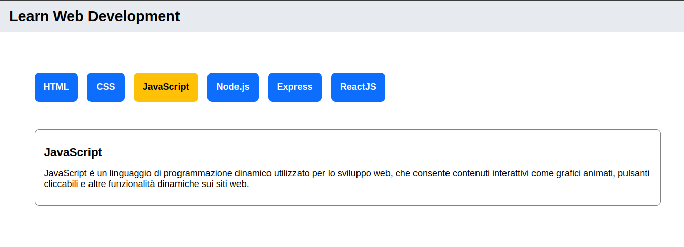

# React Use State

In questo esercizio, salvato come progetto n.39 andiamo a lavorare con react. L'obiettivo dell'esercizio è l'utilizzo di useState, una funziona messa a disposiziona da react che ci permette di creare delle variabili reattive. Queste variabili ci permettono di eseguire delle operazioni a seconda di che cosa viene fatto nel broswer dall'utente. Abbiamo lavorato con onClick, ossia al click eseguire delle operazioni specifiche.

L'obiettivo è creare dei bottoni, al click del bottone bisogna visualizzare le informazioni relative ad esso.
C'è stato passato un array di oggetti con tutte le informazioni che contengono sia i bottoni che la card con la descrizione.

Per concludere bisogna modificare il CSS della pagina, cercando di rappresentare il layout proposto così com'è. Il layout è stato realizzato con Bootstrap.
Io ho cercato di realizzarlo senza l'utilizzo di Bootstrap.

Qui di seguito lo screen della pagina.

